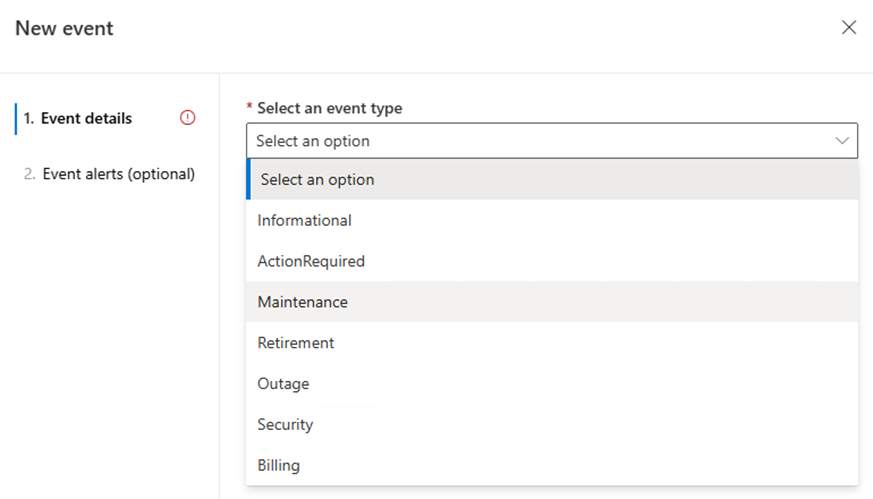

# Introduction

Last Modified: `@@LastModified`

---

## Process for Requesting a Service Notification

If a Service Team (ST) needs our help sending communications to AGC customers related to upcoming planned system events, they will contact the AGC AzComms team by submitting a request via the [SN Intake Site](https://cxpservicecomms.azurewebsites.net/EmailIntake)

If an engineer attempts to contact us directly: 

- Ask the engineer/service team to request an SN via the [SN Intake Site](https://cxpservicecomms.azurewebsites.net/EmailIntake). After a Service Notification (SN) request is submitted through the intake site, the process looks like this: 
    1. A LowSide (LS) IcM ticket is automatically created to the Air Gap Azure Communications Manager / Communication manager queue.  Even if the change impacts both clouds (USNat and USSec), only one LS ticket will be created. 
        - A matching HighSide (HS) IcM ticket must also be created for each impacted cloud. If the service team doesn’t create the HS ticket, our team can create it instead. 
    2. The creation of the LS IcM automatically triggers the ADO card creation.  

## Public and AGC SNs

Sometimes, the same SN will need to be sent out to both commercial/public cloud customers and AGC customers. If so, the process looks like this: 

1. The SN Intake site will create two (2) LS IcMs - one assigned to the Public AzComms team, and one assigned to the AGC AzComms team. 

The Service PM will draft the SN customer message in a LiveLink document, *but they will only attach it to the Public AzComms team's IcM ticket*. You will be able to find the live link by searching for the Public IcM; the IcM number will be in the discussion of the IcM to AGC AzComms. 

## What is Required to Complete a SN?

To complete the SN Event creation in ACM, the operator will need to make sure they have all the information listed below from the requester before they can begin the work: 

- **Impacted Customers** - All of the following: 

    - **Cloud(s)**: USec or USNat? Or both? 

    - **Service(s)**: Which Azure Services will be impacted? Use only external Service names. 

    - **Region(s)**: Which Azure Regions? 

    - **Subscription ID(s)**: Which specific customer Subscriptions are impacted? ST  requester should paste them into the HS IcM ticket. 
    
- Start time: When will the change start? 

- End time: When is it expected to be completed? In addition, to create the communication in ACM the operator will need to enter several other pieces of data, including: 

- **Event Type** - The options are: 

    - **Informational**: Advisory communications that do not meet the criteria of an [Outage](https://eng.ms/docs/cloud-ai-platform/azure-cxp/cxp-cre/crisis-management/azure-incident-management/azure-incident-management/cen/azurecen).
    - **ActionRequired**: Informs customers of recommended or required action(s) to be applied to their Service configuration to avoid disruption.
    - **Maintenance**: Communications about periodic actions taken to maintain the health of a Service. Maintenance actions may include (but are not limited to): deploying updates, hotfixes, or physical hardware repairs. 
    - **Retirement**: Communication about the decommissioning or replacement of a product or feature currently available to any number of users. 
    - **Outage**: NOT used for SNs (only Outages).  
    - **Security**: This is a normal SN in Public Azure, but there is a stricter set of rules for the AGC, so AzComms does not handle these requests. Contact the CSM if the SN request refers to any kind of security-related matter.
    - **Billing**: These are billing communications that will be sent to the billing administrator of the impacted subscriptions. Unlike other comms, they are not sent through the Azure Portal Service Health blade. 
    
    
    
    <em>CAPTION: ACM Event Types.</em>

If any of the above is not clear, or is not included in the LS IcM ticket and ADO card, the operator should: 

1. Contact the ST requestor in the Teams chat for this SN and ask for the missing information. 

2. Add a new Comment on the ADO card every time the operator reaches out to the requestor – or any other SN-related POC. This is needed for documenting any delays. 

3. As the information is collected, the operator should update the ADO card where appropriate. 

    a. Use the Snipping Tool to document a screenshot of the Teams chat and/or type a comment updating the status of what you are waiting on or what you have received, ie subscriptions id’s, waiting for ST response, waiting for/receiving the public IcM approval. 

4. If the operator is not able to collect all the needed information from the requestor in a timely manner, they may need to escalate the issue (see “Escalate Information Requests,” below). 

>[!NOTE]
>Most customer messages are considered public knowledge – except the details about the impacted customers. The SubIDs for the impacted Clouds are sensitive information that can only be shared by, and with, a tented team member. They are NOT shareable over public clouds. Check the [Program Updated Guidance (PUG)](https://microsoft.sharepoint.com/:b:/r/teams/CST_NationalSecurity/Shared%20Documents/National%20Security%20Data%20Governance/Program%20Updated%20Guidance.pdf?csf=1&web=1&e=fpeVa3) for detailed guidance on data handling principles. 

At a minimum, SN requests are supposed to be submitted fourteen (14) calendar days, plus two (2) business days in advance to allow the AGC AzComms teams time to send the communication. 

>[!NOTE]
>If an Maintenance SN request is received with advance notice between fourteen (14) days and seven (7) days, the SN request can still move forward, but operators should call that out to the ST requester so they are not surprised if it becomes an Emergency Maintenance when it crosses the seven (7) day notice threshold while we are waiting for information. Basically, the SN process has to be expedited to get it out before it becomes Emergency Maintenance.