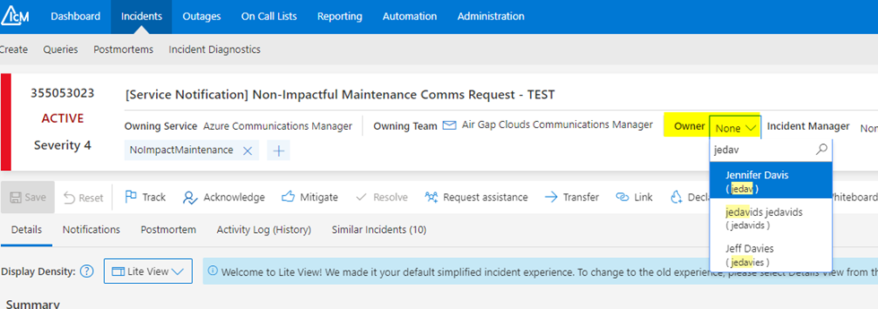

# Acknowledging the Service Notification

Last Modified: `@@LastModified`

---

## Meeting the TTA SLA 

When a new SN is received – unless they are actively working on an Outage or other high-priority support tasks – the AGC AzComms operator on call at that time should open and begin working on the SN as soon as possible. 

Operators starting a new shift should immediately open the [IcM AzComms Ticket Queue](https://portal.microsofticm.com/imp/v3/incidents/search/advanced?sl=y4j1kugh1bg) and review the list of tickets there to see if the team on the earlier shift was unable to begin working on any new requests. 

>[!NOTE]
>If any tickets have not yet been acknowledged, the new operator should open, acknowledge the LS IcM ticket, and begin working on it right away.

The operators coming on shift should also check their emails, in case an SN request came in from the Commercial team without an LS IcM. 

>[!NOTE]
>There is a **48-hour/2-day Time to Acknowledge (TTA) SLA** for Service Notifications in IcM. This should allow plenty of time for someone on the team to pick it up. 

To acknowledge a new SN request:  

1.	**Open the LS IcM ticket** for the new SN by clicking on it in the queue. 
    - Or, from the [Teams Channel](https://teams.microsoft.com/l/channel/19%3Af5333433a4b94a149009bfd95438a73b%40thread.tacv2/SN%20and%20Publish%20IcMs%20(Sev%203%2C%204)?groupId=297fb1a7-1622-4824-8fe4-f461fb04b98b&tenantId=72f988bf-86f1-41af-91ab-2d7cd011db47) notification, click on the "View in IcM" button. 

2.	Once the IcM has opened, the operator should assign the IcM to themself by clicking the down arrow for "Owner" and typing in your alias. 

3.	Save this change by clicking the “Save changes” button in the upper right of the window.

<em>CAPTION: The IcM SN ticket showing the Owner drop-down menu.</em>

4.	**Acknowledge the SN** by clicking the Acknowledge button in the IcM header. 

>[!WARNING]
>Do not forget step four (4) above! The SLA is not satisfied until the IcM ticket is Acknowledged. 
