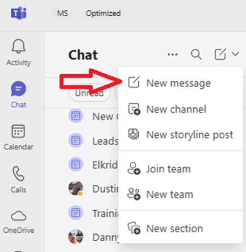
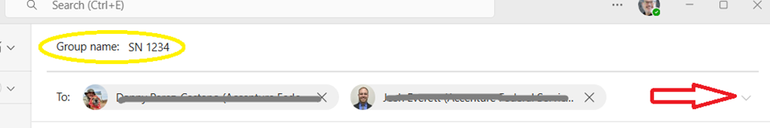

# Contacting the POC

Last Modified: `@@LastModified`

---

Once you identify the correct point of contact (either the original requestor or the AGC representative), reach out though teams to request any information that was missing from the “Information Gathering” step

The questions to the requestor should be tailored based on the information provided in the request. For example, the operator may need to ask one or more of the following questions: 

- **If a USSec and/or USNat LS IcM ticket was not created:** Does this Service Notification apply to USSec or USNat? Or both? 

- **If the HS IcM ticket was not created, or if it does not include the SubIDs**: Is the Subscription ID list shared in the HS IcM? If not, can you provide the SubID list

If the requestor does not respond within 24 hours, create a group chat with the next [escalation point](Helpful%Resources/escalating-information-requests.md) included by doing the following: 

1.	On the LS, open Teams. 

2.	In the Chat application, open the Chat menu dropdown at the top of the left Chat navigation list. 

<em>CAPTION: Creating a new Teams group chat.</em>

3.	Select “New Message” in the dropdown menu. 

4.	In the new Chat window that opens on the right, start typing the names of the people that will be involved with the SN communications. This should include the following people: 
    - Requestor
    - The ST PM 
    - Backup AGC AzComms operator (in case a handoff is needed) 

5.	Name the Teams chat by clicking on the pencil icon n icon next to the names at the top of the Chat window and typing in a “Group name” in the field above. Use the following convention: 
    - **SN [ADO Card Number]** 
        <em>Example:  
        SN 4562</em>

<em>CAPTION: Naming the Teams group chat.</em>

6.	Add the Teams chat name to the ADO card as a note with the backup on-call operator listed.

7.	The operator should start the chat to the ST by introducing themselves and sharing the appropriate links and initial questions:
    - Send the following messages: 

><em>Hi [ST Requestor and ST PM]! I am the AGC AzComms team and we received this service notification request: [Link to LS IcM].   
>   - [Insert questions]  
>  
>
b. If you do not receive a response from the requestor or PM within 24 hours, refer to the [Escalation Procedures](https://eng.ms/docs/cloud-ai-platform/azure-edge-platform-aep/cai-silver/experience-silver-/silver-problem-management/service-notifications/vendorresources/helpfulresources/escalating-information-requests). 

>[!NOTE]
>**DO NOT** create multiple group chats for the same SN. When pulling additional contacts into the conversation, add them to the original group chat. 