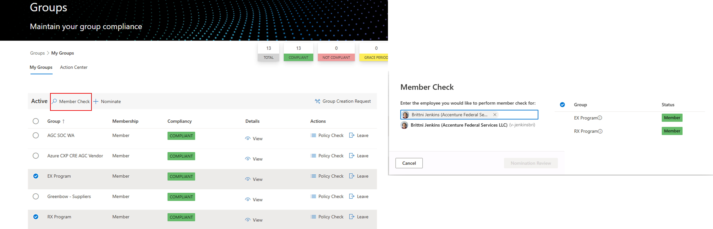
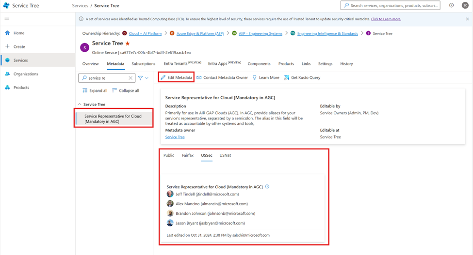

# Find a POC

Last Modified: `@@LastModified`

---

## Determine Whether the Requestor is Tented

First, confirm if the original requetor is tented using [Personnel Groups](https://personnel.microsoft.com/groups/mygroups)

- If yes: proceed to the steps under [Contact POC](contact-poc.md)
- If no: use the message below to ask the requestor for an AGC point of contact (POC):

        Hi [Requestor Name], I’m with the AGC AZComms team and we received this service notification request: [Insert IcM Link]. 

        There are a few details we need before we can send this out to the AGC clouds (USSec and USNat), but I noticed you are not tented. Do you have an AGC representative I can connect with regarding this request?

## If the Requestor Does NOT Have an AGC Representative 

The operator will need to locate the Service’s AGC Representative Using [Service Tree](https://microsoftservicetree.com/home):

1. Open the Service Tree tool and select the option "Services” on the left side panel. 

2. Use the search field at the top to locate the Service impacted by the SN. 

3. When you find the impacted Service, click on the Metadata tab. 

4. Then, in the Metadata navigation menu on the left of the main window, scroll down to the “Service Tree” sub-menu. Expand the sub-menu. Select “Service Representative for Cloud [Mandatory in AGC]”. 

    a. The operator can also filter the Metadata sub-menu by clicking and typing in the small search field below the Metadata tab. 

5. Reach out to the appropriate representative shown in main window – depending on whether the Service is in USSec or USNat. 

    a. If there is no tab on the Metadata page for either “USSec” or “USNat”, the operator should reach out to the Dev Owner of the Service, which can be found by going to Metadata > Basics > Owners (Dev/PM) sub-menu and looking in the All Clouds tab.  

>[!NOTE]
>If the operator is unable to find an AGC representative in the Service Tree to answer their questions, they should try using the the AGC Look Up Tool to search for an AGC PM. 

Once a AGC rep is identified, **reach Out to them using teams.**

Use a short intro to provide context for the request: 

    “Hi [AGC rep name], I’m with the AGC AZComms team. We received an SN request for your service, but the original requestor isn’t tented. Here’s the IcM for reference: [IcM Link] 

    I’m reaching out to confirm the AGC impact of this event and whether the it affects USSec, USNat, or both.
    

    Could you help confirm this?” 