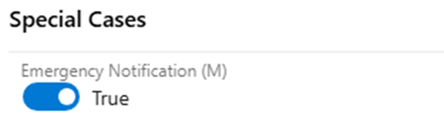

# Maintanence SN Special Considerations 

Last Modified: `@@LastModified`

---

## Reviewing the SN Request Start Date

After acknowledging the IcM ticket, the operator then needs to review the maintenance dates in the SN request. The steps after this will depend on when the maintenance is scheduled to occur. Do the following: 

1.	The operator should check the **Start Date** in the SN request to determine if there is enough time in advance of the event to complete the SN request: 

    - **Is the maintenance Start Date greater than fourteen (14) days + two (2) calendar days from today?**

        - **If yes**: Proceed to the "[Information Gathering](information-gathering.md)" page for next steps. 
        - **If no**: Go to the next question below. 

    - **Is the Start Date between seven (7) days and fourteen (14) days from today?**

        - **If yes**: The operator should notify the ST requester that they have (x) days until the SN becomes an Emergency Maintenance request. In order to avoid the extra steps involved in the Emergency Maintenance process, they should try to expedite getting the required information and approvals needed. 
            - Then proceed to the Reviewing the Other Details section of this page for next steps.
        - **If no**: Go to the next question below. 

    - **Is the maintenance Start Date less than seven (7) calendar days from today?**

        - **If yes**: Proceed to the “Rescheduling Planned Maintenance” steps described below. 

### Rescheduling Maintenance 

If the maintenance is less than seven (7) calendar days from the current date, the operator needs to determine if this SN request should proceed as Emergency Maintenance – or if it can be rescheduled to allow a normal the team to proceed with a normal SN request. Do the following:  

1.	Open Teams and click on the Teams group chat that was created for the SN currently being worked on. 

2.	Send the follow message to the ST Requestor: 

    _I see that the maintenance start date for this Service Notification is in [XX] days. That is below the required number of days in advance for a standard Service Notification and does not give the customer sufficient time to make any needed preparations on their side._

    _So, I need to ask you if it can be rescheduled? If it can be pushed back to [DD MM YYYY 14 DAYS FROM TODAY], we can proceed with a standard Service Notification._ 

    _If not, it will need to be managed as an Emergency Maintenance Service Notification. (See the “[Emergency Maintenance](https://eng.ms/docs/cloud-ai-platform/azure-edge-platform-aep/cai-silver/experience-silver-/silver-problem-management/service-notifications/vendorresources/otherprocesses/managing-emergency-maintenance-sns)” TSG for more information)._ 

3.	Wait for their reply. 
    - **If the ST requester agrees to reschedule the maintenance** to meet the normal SN timing rule, then the operator can manage the request as a standard Service Notification. Do the following: 

        i.	Ask the ST Requestor to update the LS and HS IcM tickets with the new planned maintenance dates. 

        ii.	When the IcM tickets have been updated, open the ADO card, and on the Details tab, note the change by adding a new comment in the ADO card discussion. 

        iii.	Update the **Event Start Time** and **Event End Time** fields on the Details tab in ADO with the new IcM dates. 

        iv.	Proceed to the Confirming the Details page for next steps. 

    - **If the ST requester is _NOT_ able to change the start date** of the planned maintenance, then the SN will need to be managed as an Emergency Maintenance SN. 

        i.	Update the ADO card to mark it as Emergency Maintenance by clicking on the “**Emergency Notification (M)**” toggle in the middle column of the Details tab and changing it to “**True**”. 

        ii.	This changes the ADO card to orange on the SN ADO Board. 

        iii.	Proceed with the Emergency Maintenance process (see “Reviewing Other Details” section in the “[Managing Emergency Maintenance SNs](../Other%20Processes/Emergency_Maintenance/managing-emergency-maintenance-sns.md)” page on this EngHub site).  

<em>CAPTION: ADO Card Emergency Notification toggle setting.</em>

## Reviewing Other Details

After reviewing the SN Start Date and confirming the timing aligns with a standard SN, it is important for the operator to review and understand the details of what is being requested before preparing the SN communications for sending. Sometimes gathering the full context and all the needed information requires some back and forth between the operator and the ST requestor and other engineers. 

- **Communication State / Stage** - The options are:

    - **Planned**: If the maintenance is planned for a certain timeframe
    - **InProgress**: If the maintenance is currently underway – used if an update is needed during the maintenance period 
    - **Canceled**: If the previously planned maintenance has been cancelled 
    - **Rescheduled**: If the previously planned maintenance has been rescheduled 
    - **Complete**: If the maintenance was already completed – used if the Service team wants to provide an update to the customers after the maintenance is done (rarely happens) 

- **Impact Category** – The options for SNs are: 

    - **Data Availability**: Disruption or degradation in access to data stored or processed within Azure service.
    - **Network Connectivity**: Disruption, degradation, or failure in the ability of Azure resources to communicate across networks.
    - **No Impact Expected**: No customer impact is expected. 
    - **Other (refer to message for details)**: Use this category when none of the other options align with the customer message. 
    - **Performance Degradation**: Where Azure services or resources experience slower-than-expected performance, increased latency, or reduced throughput, but remain operational.
    - **Service Availability**: Disruption or degradation in the ability of Azure services to operate normally, affecting the availability of resources such as virtual machines, databases, or applications.
    - **Service Management Operations**: Disruption or degradation in the ability to manage Azure resources (control plane activities), such as creating, updating, or deleting virtual machines (VMs), modifying network security groups, changing access permissions, etc. 

If any of the above is not clear, or is not included in the LS IcM ticket and ADO card, the operator should:

1.	Contact the ST requestor in the Teams chat for this SN and ask for the missing information. 
2.	Add a new Comment on the ADO card every time the operator reaches out to the requestor – or any other SN-related POC. This is needed for documenting any delays. 
3.	As the information is collected, the operator should update the ADO card where appropriate. 
4.	If the operator is not able to collect all the needed information from the requestor in a timely manner, they may need to escalate the issue (see “Escalate Information Requests,” below).  

>[!NOTE]
>Most maintenance messages are considered public knowledge – except the details about the impacted customers. The SubIDs the impacted Clouds are sensitive information that can only be shared by, and with, a tented team member. Check the [Program Updated Guidance (PUG)](https://microsoft.sharepoint.com/:b:/r/teams/CST_NationalSecurity/Shared%20Documents/National%20Security%20Data%20Governance/Program%20Updated%20Guidance.pdf?csf=1&web=1&e=fpeVa3) for detailed guidance on data handling principles. 
