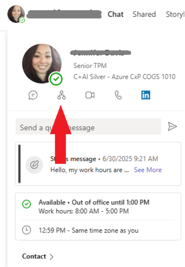

# Escalating Information Requests

Last Modified: `@@LastModified`

---

## When to Ask for Help

If the SN request is incomplete, or if the information provided is not clear, the operator will need to get additional details and clarifications from the requestor and/or possibly other members of their team. 

However, sometimes the requestor or other engineering team members fail to provide that information in a timely manner. If that happens, the operator will need to escalate the request to the CSM. The escalation path is as follows: 

<em>CAPTION: SN escalation path.</em>

1.	If the original requestor fails to respond to the operator’s requests within one (1) business day, the operator should contact the relevant AGC PM contact. 

2.	If the AGC PM Contact does not respond within one (1) business day, the operator should contact the manager of the AGC PM. The operator can find them by looking them up in the Microsoft Global Directory. To do that: 

    a.	Open Teams, click in the Search bar at the top of the window and type the name of the AGC PM. 

    b.	When their name appears in the drop-down menu, click on it to open a chat window with them. 

    c.	Hover over their name (or their profile photo) at the top of the chat window. When the profile card opens, click on the Org Chart button below their profile picture to navigate to their org chat. 
    
    d.	The operator can contact the person immediately above them in the org chart in Teams. 

<em>CAPTION: Navigate to a Teams user’s org chart by clicking this button.</em> 

3.	If the AGC PM Contact’s manager does not respond within one (1) business day, the operator should contact the AFS Workstream Lead for help and further escalation. 

4.	**_If all of the above options do not work, a member of the AGC AzComms team, or the AFS Workstream Lead, will need to escalate the issue to the CSM_**. 
    - When the issue is escalated, the operator should add the following tag to the ADO card so the CSM can easily find it in ADO: "**Escalated**".

5. As they proceed up the escalation path chain, the operator should document each step by adding a comment in the ADO card recording what action(s) they took and when. 
    - The operator should post the same Discussion comments into the originating SN IcM ticket so that the ST can also see them. 

6. Any SN that has not had any updates for more than seven (7) calendar days will have the “**NoUpdate**” Tag added to the ADO card by the CSM. 

## Putting an SN On Hold 

The operator can use the ADO card “Tag” field to put an SN request on hold – if the request has become substantially delayed or is blocked for some external reason.

>[!NOTE]
>This is normally only used when there is a significant deviation from the documented SN process and timeline.

If there is a significant issue with the request, the operator should:

1.	Add the “**OnHold**” tag to the ADO card. 

2.	The operator should also alert the CSM that the SN is now on hold. 