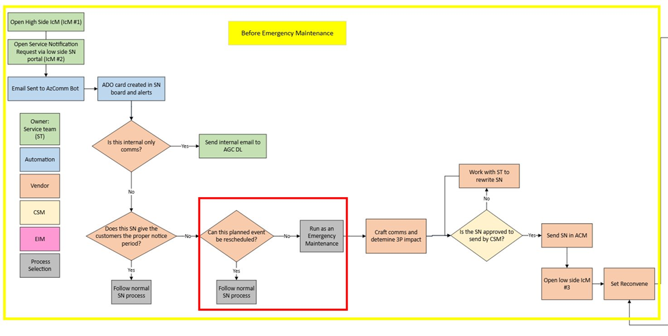
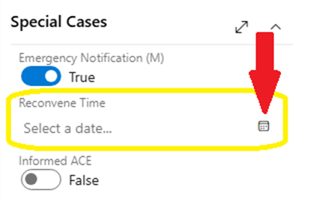

# Before the Emergency Maintenance Occurs 

Last Modified: `@@LastModified`

---

## Getting Organized

The Emergency Maintenance process begins as a standard SN request. Most of the AGC AzComms work takes place before the Emergency Maintenance event takes place. The diagram below focuses on the steps that occur before the maintenance. 

  
<em>CAPTION: The Emergency Maintenance process steps that occur before the scheduled maintenance.</em>

At a high level, the SN request process starts with the following steps: 

1. ST requester opens an HS IcM ticket (IcM #1) and assigns it to the AGC Azure Communications team, which should include the impacted Subscription IDs (SubID) list. 
    - This ticket does not replicate to the LS. 

2. ST requester opens an LS IcM ticket (IcM #2) to request a Service Notification (SN).

When the LS IcM SN ticket is assigned to the AGC AzComms team, several things happen: 

1. The LS IcM SN ticket appears in the [IcM AzComms Ticket Queue](https://portal.microsofticm.com/imp/v3/incidents/search/advanced?sl=5fpsbeixkjl). 

>[!NOTE]
>Operators should keep the LS IcM queue open at all times. Also, they should ensure that Auto Refresh is enabled with a 1-minute setting to actively monitor the queue.

2. The System automation creates a linked Azure DevOps (ADO) card on the [Service Notification Board](https://dev.azure.com/AzureCRE-AGC/Service%20Notifications/_boards/board/t/Service%20Notifications%20Team/Service%20Notifications) based on the data in the LS IcM ticket. 

3. The SN is also posted to the [SN and Publish IcMs (Sev 3, 4)](https://teams.microsoft.com/l/channel/19%3Af5333433a4b94a149009bfd95438a73b%40thread.tacv2/SN%20and%20Publish%20IcMs%20(Sev%203%2C%204)?groupId=297fb1a7-1622-4824-8fe4-f461fb04b98b&tenantId=72f988bf-86f1-41af-91ab-2d7cd011db47) channel in Teams. From this message the operator can access the LS ADO card, the LS IcM ticket, and the related TSG.

### Acknowledging the Service Notification 

When a new SN is received, the next available operator on duty should open and begin working on the Outage as soon as possible. 

>[!NOTE]
>There is a 48-hour/2-day Time to Acknowledge (TTA) SLA for Service Notifications in IcM. This should allow plenty of time for someone on the team to pick it up. 

To acknowledge a new SN:  

1. **Open the IcM ticket** for the new SN by clicking on it in the queue. From the Teams Channel notification, click on the "View in IcM" button. 

2. Once the IcM has opened, **assign the IcM to yourself** by clicking the down arrow for "Owner" and typing in your alias. You need to save this change or the IcM will not be saved.

<em>CAPTION: The IcM SN ticket showing the Owner drop-down menu.</em>

3. **Acknowledge the SN** by clicking the Acknowledge button in the IcM header. 

>[!WARNING]
>Do not forget step three (3) above! The SLA is not satisfied until the IcM ticket is acknowledged. 

### Changing the ADO Card Status and Owner

When the operator has acknowledged the IcM ticket, they should then update the ADO card: 

1. Open the [SN ADO Board](https://dev.azure.com/AzureCRE-AGC/Service%20Notifications/_boards/board/t/Service%20Notifications%20Team/Service%20Notifications).

2. The operator can update the status and assign the ticket to themself by dragging and dropping the ADO card from the “New Requests” column to the “**In Progress**” column on the SN ADO Board. 
    - If the ticket does not get assigned automatically to the operator when they move the card to the “In Progress” column, they can assign the ADO ticket to themselves manually. To do that: 
    - Click in the **Owner** field in the header of the ticket and start typing to search for the operator’s name. Select the name from the results drop-down list. 

>[!NOTE]
>The SN has an SLA of seven (7) calendar days from IcM submission until publication. This time includes the 2 days for acknowledgment, so it is important that the AzComms team starts working on SNs as soon as they are requested. 

### Create a Teams Chat for Comms Coordination 

Emergency Maintenance SN communications requests will require some coordination between the AGC AzComms team and the ST. This is usually done in a Teams group chat, which the operator should create by doing the following: 

1.	On the LS, open Teams. 

2.	In the Chat application, open the Chat menu dropdown at the top of the left Chat navigation list. 

<em>CAPTION: Creating a new Teams group chat.</em>

3.	Select “New Message” in the dropdown menu. 

4.	In the new Chat window that opens on the right, start typing the names of the people that will be involved with the SN communications. This should include the following people: 
    - Service PM (usually is the ST requester) 
    - CSM 
    - Backup AGC AzComms operator (in case a handoff is needed) 

5.	Name the Teams chat by clicking on the pencil icon next to the names at the top of the Chat window and typing in a “Group name” in the field above. Use the following convention: 
    - **SN [ADO Card Number]** 
        <em>Example:  
        SN 4562</em>

<em>CAPTION: Naming the Teams group chat.</em>

6.	Add the Teams chat name to the ADO card as a note with the backup on-call operator listed.

7.	The operator should start the chat to the ST by introducing themselves and sharing the appropriate links and initial questions:
    - Send the following messages: 

><em>Hello! I am the AGC AzComms operator that will be working with you on the Service Notification you submitted. For your reference: 
>   - [Link to LS IcM] 
>   - [Link to ADO card] 
>
>I am reviewing the request details now. Can you confirm the following: </em>
>

8. The questions to the Service PM should be tailored based on the information provided in the request. For example, the operator may need to ask one or more of the following questions: 

    - **If a USSec and/or USNat LS IcM ticket was not created**: _Does this Service Notification apply to USSec or USNat? Or both?_
    - **If the HS IcM ticket was not created, or if it does not include the SubIDs**: _Is the Subscription ID list shared in the HS IcM? If not, can you provide the SubID list?_
    - **If the request does not include an approval confirmation**:  
        <em>Is the customer message currently shared in the LS IcM ticket approved by the service team PM?  
        [Paste the customer message that was shared] 
        If not, who is the approving authority (POC/DRI)?</em>

## Confirming the Details 

After verifying the external customer impact, the operator then needs to review the planned maintenance dates in the SN request. The steps after this will depend on when the maintenance is scheduled to occur. Do the following: 

1.	The operator should check the **Start Date** in the SN request to determine if there is enough time in advance of the event to complete the SN request: 

    - **Is the planned maintenance Start Date greater than fourteen (14) days + two (2) calendar days from today?**

    - **If yes**: Proceed to the "**Reviewing the Other Details**" section below for next steps. 
    - **If no**: Go to the next question below. 

    - **Is the Start Date between seven (7) days and fourteen (14) days from today?**

    - **If yes**: The operator should notify the ST requester that they have (x) days until the SN becomes an Emergency Maintenance request. In order to avoid the extra steps involved in the Emergency Maintenance process, they should try to expedite getting the required information and approvals needed. 
        - Then proceed to the "**Reviewing the Other Details**" section below for next steps.
    - **If no**: Go to the next question below. 

    - **Is the planned maintenance Start Date less than seven (7) calendar days from today?**

    - **If yes**: Proceed to the “Rescheduling Planned Maintenance” steps described below. 

### Rescheduling Planned Maintenance 

If the planned maintenance is less than seven (7) calendar days from the current date, the operator needs to determine if this SN request should proceed as Emergency Maintenance – or if it can be rescheduled to allow a normal the team to proceed with a normal SN request. Do the following:  

1.	Open Teams and click on the Teams group chat that was created for the SN currently being worked on. 

2.	Send the follow message to the ST Requestor: 

    _I see that the planned maintenance start date for this Service Notification is in [XX] days. That is below the required number of days in advance for a standard Service Notification and does not give the customer sufficient time to make any needed preparations on their side._

    _So, I need to ask you if it can be rescheduled? If it can be pushed back to [DD MM YYYY 14 DAYS FROM TODAY], we can proceed with a standard Service Notification._ 

    _If not, it will need to be managed as an Emergency Maintenance Service Notification. (See the “[Emergency Maintenance](https://eng.ms/docs/cloud-ai-platform/azure-edge-platform-aep/cai-silver/experience-silver-/silver-problem-management/service-notifications/vendorresources/otherprocesses/managing-emergency-maintenance-sns)” TSG for more information)._ 

3.	Wait for their reply. 
    - **If the ST requester agrees to reschedule the maintenance** to meet the normal SN timing rule, then the operator can manage the request as a standard Service Notification. Do the following: 

        i.	Ask the ST Requestor to update the LS and HS IcM tickets with the new planned maintenance dates. 

        ii.	When the IcM tickets have been updated, open the ADO card, and on the Details tab, note the change by adding a new comment in the ADO card discussion. 

        iii.	Update the **Event Start Time** and **Event End Time** fields on the Details tab in ADO with the new IcM dates. 

        iv.	Proceed to the Confirming the Details page for next steps. 

    - **If the ST requester is _NOT_ able to change the start date** of the planned maintenance, then the SN will need to be managed as an Emergency Maintenance SN. 

        i.	Update the ADO card to mark it as Emergency Maintenance by clicking on the “**Emergency Notification (M)**” toggle in the middle column of the Details tab and changing it to “**True**”. 

        ii.	This changes the ADO card to orange on the SN ADO Board. 

        iii.	Proceed with the Emergency Maintenance process. Go to the “Reviewing Other Details” section below.  

<em>CAPTION: ADO Card Emergency Notification toggle setting.</em>

### Reviewing Other Details

After reviewing the SN Start Date and confirming the timing aligns with a standard SN, it is important for the operator to review and understand the rest of the details of what is being requested before attempting to draft the Emergency Maintenance SN comms. 

Sometimes gathering the full context and all the needed information requires some back and forth between the operator and the ST requestor and other engineers. Be aware that this can sometimes take several days. 

>[!NOTE]
>The details required to create and send an Emergency Maintenance SN communication is the same as what is needed for "regular" SNs. For the detailed descriptions of information needed for SNs, see the "[Reviewing Other Details](../../Getting%20Organized/reviewing-other-details.md)" page on this EngHub site. 

At a high level, to complete the Emergency Maintenance SN Event creation in ACM, the operator will need to make sure they have all the information listed below from the requester before they can begin the work: 
    
- **Impacted Customers** - All of the following: 
    - **Cloud(s)**: USec or USNat? Or both? 
    - **Service(s)**: Which Azure Services will be impacted? Use only _external_ Service names. 
    - **Region(s)**: Which Azure Regions?  
    - **Subscription ID(s)**: Which specific customer Subscriptions are impacted? ST PM requester should paste them into the HS IcM ticket.
- **Start time**: When will the change start? 
- **End time**: When is it expected to be completed? 
- **Duration**: Expected amount of time it will take to make the change.  

In addition, to create the communication in ACM the operator will need to enter several other pieces of data, including: 

- **Event Type**
- **Communication State / Stage** 
- **Impact category** 

If any of the above is not clear, or is not included in the LS IcM ticket and ADO card, the operator should:

1.	Contact the ST requestor in the Teams chat for this SN and ask for the missing information. 
2.	Add a new Comment on the ADO card every time the operator reaches out to the requestor – or any other SN-related POC. This is needed for documenting any delays. 
3.	As the information is collected, the operator should update the ADO card where appropriate. 
4.	If the operator is not able to collect all the needed information from the requestor in a timely manner, they may need to escalate the issue (see “Escalate Information Requests,” below).  

>[!NOTE]
>Most maintenance messages are considered public knowledge – except the details about the impacted customers. The SubIDs the impacted Clouds are sensitive information that can only be shared by, and with, a tented team member. Check the [Program Updated Guidance (PUG)](https://microsoft.sharepoint.com/:b:/r/teams/CST_NationalSecurity/Shared%20Documents/National%20Security%20Data%20Governance/Program%20Updated%20Guidance.pdf?csf=1&web=1&e=fpeVa3) for detailed guidance on data handling principles. 

## Preparing the Customer Message

After reviewing the SN request and receiving all of the needed information for the customer communications, the operator will create the external customer notification. When approved and published, this information will appear in the Service Health blade in the Azure Portal.

First, the operator will need to move the proposed customer message from wherever it has been drafted by the engineering team to ADO to create the final draft and get it reviewed and approved by the CSM. 

With SNs, the engineering team – usually the SN requester – creates the initial draft of the customer message. They start the customer message draft from a template in SharePoint.

>[!NOTE]
>The steps to prepare the Emergency Maintenance SN customer message are the same as the steps used to create a "regular" SN customer message. For the detailed, step-by-step instructions, see the "[Preparing the Customer Message](../../Preparing%20the%20Customer%20Message/preparing-customer-message.md)" section of this EngHub site. 

At a high level, the steps are as follows: 

1. Copy the customer message to ADO 
2. Create the final, customer-ready, draft of the customer message 
3. Get the customer message draft approved by the Service Team PM and the CSM

## Publishing the Emergency Maintenance SN 

Once the customer message is approved, they can proceed to publishing the SN in the HS ACM. 

>[!NOTE]
>The steps to publish the Emergency Maintenance SN in ACM are the same as the steps used to publish the "regular" SN customer message. For the detailed, step-by-step instructions, see the "[Publishing the SN](../../Publishing%20the%20SN/publishing-sn.md)" section of this EngHub site. 

At a high level, the steps are as follows: 

1. Send the Emergency Maintenance SN from the LS to the HS using the CTS Portal 
2. Create a new Event in ACM 
3. Create a new Communication in ACM 
4. Copy/paste the Emergency Maintenance message from the HS CTS Portal into the new Communication in ACM
5. Confirm all hyperlinks work on the HS 
6. Manually re-apply all text formatting, such as bold, italic, bullets, etc. 
7. Save and publish the SN comms. 

## Scheduling a Reconvene

Finally, before the Emergency Maintenance occurs, the AGC AzComms team operator needs to set up the meeting and the engineering bridge that will be used to monitor the progress of the maintenance. That part of the process includes these steps: 

1. The ST requester opens a new LS IcM ticket (IcM ticket #3) as a Severity 3, and assigns it to themselves. 

2. The operator will schedule a Reconvene for the team to use as the engineering bridge. A Reconvene is a scheduled meeting (in Outlook) for the teams – including the AGC AzComms operator – that includes a Teams meeting link and other relevant details. 

>[!NOTE]
>For more detailed, step-by-step instructions on creating Reconvenes, see the “[Scheduling Reconvenes](https://eng.ms/docs/cloud-ai-platform/azure-edge-platform-aep/cai-silver/experience-silver-/silver-problem-management/azure-outage-communications/frontlinelivesite/schedulingreconvenes/scheduling-reconvenes)” TSG on the AGC AzComms Outages EngHub site. 

The Reconvene meeting invitation for the Emergency Maintenance should include the following details:

- **Subject**: Use the following template: 

  RECONVENE: Emergency Maintenance for IcM #[LS TICKET 3 NUMBER] – [CLOUD] HS IcM #[HS TICKET 1 NUMBER]

  <em>Example:   
  RECONVENE: Emergency Maintenance for IcM #123456 – USSec HS IcM #567890 </em>

- **Date and time**: When the ST will begin the maintenance work (confirmed with ST requester) 

- **Required attendees** include:  
    - **EIM**: Check the EIM on call list  
    - **CSM**: Jedav@microsoft.com  
    - **Advanced Cloud Engineer (ACE)**: If applicable, operator will be provided with their alias by the ST requester  
    - **DRI**:  The Designated Responsible Individual for overseeing the maintenance work  
    - **ST**: The Service team that will be working on the maintenance. Get their email addresses from the ST requester.    
    - **AGC AzComms operator backup**: Invite a backup in case the original operator will not be available at the scheduled time. Check the [AGC AzComms team on call schedule](https://portal.microsofticm.com/imp/v3/administration/teamdashboard/oncall?id=104752) to see who else will be on call during the maintenance window. 

- **Optional attendees**:   
    - Include this distribution email address for the entire AGC AzComms team:  AzureCXPCREAGCVendor@service.microsoft.com 

- **Reminder**: Ensure a 15-minute reminder is set for the meeting. 

- Use this template for the **body of the invitation message**:

>This is a reconvene for Emergency Maintenance IcM #[LS TICKET 3 NUMBER] – [CLOUD] HS IcM #[HS TICKET 1 NUMBER]
>
>**Agenda**
>- [List agenda item here. Confirm with ST requester or DRI]
>- [List agenda item here. Confirm with ST requester or DRI]
>- [List agenda items here. Confirm with ST requester or DRI]
>
>**Summary of Maintenance**:
>[Summary of maintenance planned. Get from the approved customer message sent in ACM]
>
>**Bridge Info**:
>[Teams link and dial-in information]

3. After the operator has confirmed that all the details of the invitation are now correct, they should send the meeting invitation: 

    a.	Click the “Send” button. 

    b.	This will add the meeting to everyone’s calendar. 

## Updating the ADO Card

After sending out the Reconvene invitation, the operator should update the ADO card: 

1.	Open the ADO card for the Emergency Maintenance. 

2.	Under the metadata category “Special Cases” on the Details tab, fill in the “Reconvene Time” field by clicking on the calendar icon and selecting the day and time of the meeting. 

<em>CAPTION: Updating the Reconvene day and time in ADO.</em>

