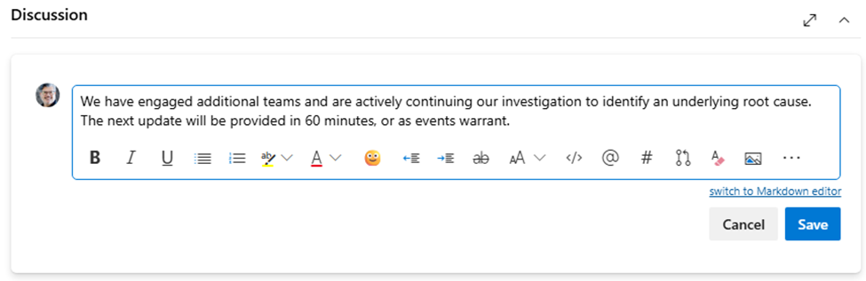

# Day of the Emergency Maintenance 

Last Modified: `@@LastModified`

---

## While the Work is Being Performed 

On the day and time of the scheduled Reconvene, the ST will start the engineering bridge by following the link in the Outlook calendar meeting. 

>[!NOTE]
>If the service team does not start the bridge within five (5) minutes of the start time, the EIM will start the bridge.

The AGC AzComms team operator, the ST, and EIM will join the bridge and run the call similar to how a Live Site Incident Outage bridge works – except for the Outage customer communications. 

**Customer communications are only needed during Emergency Maintenance when requested by the Service team or if an Outage is declared because new customer impact is discovered.**

### On the Reconvene Bridge

While on the Emergency Maintenance Reconvene meeting, the following occurs: 

1. The service team performs the maintenance tasks.
2. The EIM will monitor for additional impact: 
    - If any of the following conditions occur: 
        - Additional customers are impacted.
        - Additional downstream services are impacted.
        - Additional control or data plane impact is experienced by customers.
        - Additional time is necessary to complete the maintenance.
    - The EIM will declare an Outage and run the incident appropriately (see the “[Managing Outage Communications](https://eng.ms/docs/cloud-ai-platform/azure-edge-platform-aep/cai-silver/experience-silver-/silver-problem-management/azure-outage-communications/frontlinelivesite”) page on the EngHub for more information).
3. If the DRI requests it, the operator will need to draft, get approved, and send customer Update communications (see “Sending Update Communications” below). 
4. If the Emergency Maintenance is not complete by the end of the planned duration, the EIM will work with the operator to schedule an additional Reconvene. 
5. Repeat steps 1-4 above as needed until the maintenance is complete and mitigation is declared.

### Sending Update Communications

If the DRI decides it is necessary, they will ask the AGC AzComms operator to send out customer communications during the while the Emergency Maintenance tasks are being performed. 

<!--
These Updates could include communications related to: 
- GET EXAMPLES
-->

It may be necessary to send out multiple customer Update messages while the Emergency Maintenance is happening. Repeat the steps below as needed. 

To draft customer Update messages during Emergency Maintenance: 

1.	Open the ADO card, click on the “Basic Templates” tab.
2.	In the first column on the left, locate the “Active Updates” section. 
3.	Select the “Current Status” statement from the templates shown that best fits the current situation – reflecting any change in status since the last post. There are templates provided that cover different variations on the following scenarios: 
    - No new information
    - Problem identified
    - Mitigation efforts underway

>[!NOTE]
>Always use the most current, approved templates provided in ADO. They are updated on a regular basis. 

4.	Select the text of the Update template that most closely matches the current situation and copy it to the pasteboard by typing Ctrl+c. 
5.	Click on the “Details” tab. In the “Discussion” thread section in the lower left of the page and paste (Ctrl+v) the template text into a new Comment card. This keeps a running record of the Updates for everyone involved. 
6.	Edit the customer message text as needed in the Comment card. 

<em>CAPTION: Update draft saved in a Comment card in the Discussion thread.</em>

7.	Save the Update message by clicking the “Save” button on Comment card. 
8.	Ask the DRI on the Reconvene bridge to review and approve the customer message, either by sending it to them in the Teams chat or by asking them on the Emergency Maintenance bridge call (if there is an opportunity to do so). 
9.	Wait for their feedback and approval. 

    a. If the DRI asks for changes, make those as quickly as possible, and send the updated version back to them for review. 

    b. Repeat step 9.a until the DRI approves the customer Update message. 

    c. Make sure the final, approved version is saved in the ADO card. 

10.	When the Update message is approved, open the ADO card. On the “Details” tab, select the approved Update message in the “Discussion” card, and copy it to the pasteboard by typing Ctrl+c. 
11.	Open the LS CTS Portal. 
12.	Create a new Paste, give it a Name, and paste (Ctrl+v) the approved Update message into “Paste Content” field. 
13.	Click “Create” to send the Update message to the HS CTS Portal. 
14.	Open the CTS Portal on the HS, locate the new Paste, and copy the approved Update customer message to the pasteboard by typing Ctrl+c. 
15.	In the HS ACM, on the Events page, select the Emergency Maintenance Event that was created previously by clicking on the Tracking ID Link.
    - Confirm the correct Event has been selected.
16.	Select “Show Actions” (three dots menu) on the previous communication.
17.	Select “Send Update”. This copies most of the information from the previous message, saving the operator time in filling out the communication forms. 
18.	Update the information on the ticket as needed based on the information available at the current time: 

    a. On the “**Communication State**” tab, update the following:
    - **Description**: [Service] – [Region] – Update
    - **Stage**: Active
    - **Severity**: [Informational/Warning/Critical]
    - Select “Next”

    b. On the “**Impacted Customers**” tab, the information should remain the same as we are just providing an Update (unless additional impacted customers have been identified).

    c. On the “**Author Communication**” tab, update any of the following that may have changed since the last communication: 
    - **Customer Title**: Copied and pasted from ADO using the CTS Portal. This remains the same until the issue is mitigated. 
    - **SMS Message**: Skip. This feature is not available in the AGC. 
    - **Portal Message**: This was previously drafted on the LS in ADO (see Step 4 above). Use the CTS Portal to Copy and Paste – as plain text – the approved message. Then manually re-apply formatting, including: 
        - Hyperlinks
        - Bold, italics
        - Bullets
19.	When the Update is ready to be sent out, select “Save and Publish.”
