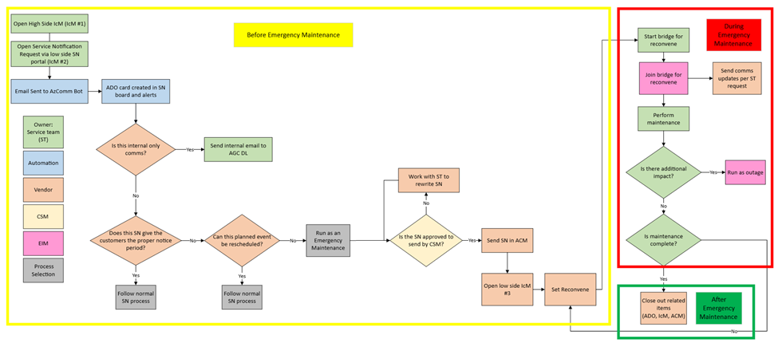

# Managing Emergency Maintenance SNs

Last Modified: `@@LastModified`

---

## What is Emergency Maintenance? 

This TSG covers the process for sending targeted communications to Azure AirGapped Cloud (AGC) customers related to Emergency Maintenance Service Notifications (SNs). 

>[!NOTE]
>This TSG does not cover the process for managing communications related to Outages. For more about Outage communications, see the [Managing Outage Communications page](https://eng.ms/docs/cloud-ai-platform/azure-edge-platform-aep/cai-silver/experience-silver-/silver-problem-management/azure-outage-communications/frontlinelivesite) on EngHub.  

The Azure CXP AirGapped Clouds Team (AGC AzComms) is one of two (2) teams responsible for the creation and dissemination of customer communications related to Microsoft Azure services. AGC AzComms is engaged when maintenance is planned to occur within the classified US government Clouds (USNat and USSec). The AGC AzComms team manages the communications related to these events – called “Service Notifications” (SNs) – that keep government customers informed about the details of the upcoming change, and if any actions are needed on their part.  

Standard SN requests are submitted fourteen (14) calendar days, plus two (2) business days, in advance to allow the AGC AzComms teams time to send the communication. However, if there is not sufficient time to publish a standard SN, it must be handled differently. For this reason, an SN that will occur within seven (7) calendar days or less, is called an Emergency Maintenance SN. 

The Emergency Maintenance SN process is similar to the standard SN process, but with a couple of differences: 

- An additional IcM ticket is created in order to track the Emergency Maintenance communications. 
- A scheduled Reconvene is created to conduct an engineering bridge call while the maintenance is being performed. 
- While the maintenance is going on, if the Service team requests it, the AzComms operator will send out Update communications to customers.

If the operator is familiar with both the Outage and SN processes, they should be able to manage Emergency Maintenance SN communications successfully as well. 

### Helpful Resources

Background and more detailed training information can be found here: 
- [Managing Outage Communications](https://eng.ms/docs/cloud-ai-platform/azure-edge-platform-aep/cai-silver/experience-silver-/silver-problem-management/azure-outage-communications/frontlinelivesite) (EngHub) 
- [Scheduling Reconvenes](https://eng.ms/docs/cloud-ai-platform/azure-edge-platform-aep/cai-silver/experience-silver-/silver-problem-management/azure-outage-communications/frontlinelivesite/schedulingreconvenes/scheduling-reconvenes) (EngHub)
- [Emergency Service Notifications](https://microsoft-my.sharepoint.com/:p:/g/personal/jedav_microsoft_com1/EValYJNDUMFFutyDOrJHPy8B9gCp6eF-1y0wHw8DVfspVQ?e=FwccG2) (slides)

### Tools Needed

To complete the work described in this TSG, you will need access to both High Side (HS) and Low Side (LS) resources.

**On the High Side (HS):**  

- **Azure Communications Manager (ACM)**: Use ACM to post communications to external customers. 
- (**Cloud Transfer Service Portal (CTS Portal)**): Use the CTS Portal copy/paste information gathered from various sources across the networks. 
- **HS IcM**: HS IcM is used to obtain impacted external customer detail, including Subscription IDs (SubIDs).  

**On the Low Side (LS):**  

- **Microsoft Teams**: Service Notification requests are posted in the shared Teams channel [SN and Publish IcMs (Sev 3, 4)](https://teams.microsoft.com/l/channel/19%3Af5333433a4b94a149009bfd95438a73b%40thread.tacv2/SN%20and%20Publish%20IcMs%20(Sev%203%2C%204)?groupId=297fb1a7-1622-4824-8fe4-f461fb04b98b&tenantId=72f988bf-86f1-41af-91ab-2d7cd011db47), and much of the communication with the engineering team occurs in Teams.  
- **LS IcM**: Service Notification tickets are created and tracked on this [IcM Board](https://portal.microsofticm.com/imp/v3/incidents/search/advanced?sl=1d2fbsaa1r1).  
- **Azure DevOps (ADO)**: An ADO card is created for each IcM SN ticket on this [ADO Board](https://dev.azure.com/AzureCRE-AGC/Service%20Notifications/_boards/board/t/Service%20Notifications%20Team/Service%20Notifications), and the AzComms work is documented in those cards. 
- **AGC Lookup Tool**: Use the [AGC Lookup Tool](https://msit.powerbi.com/groups/me/reports/ba9f535e-36b4-420c-bc7c-55b5ff34e20d/ReportSectionaed44c157e7ed32d6336?ctid=72f988bf-86f1-41af-91ab-2d7cd011db47&experience=power-bi) to verify if a requestor is tented.  
- **Service Tree**: Use the [Service Tree tool](https://microsoftservicetree.com/home) to look up the ownership of Azure services and products in order to complete the SN. 
- **Cloud Transfer Service Portal (CTS Portal)**: Use the [CTS Portal](https://ctsportal.trafficmanager.net/pastes) copy/paste information gathered from various sources across the networks. 
- **Microsoft Word**: To review Live Link documents, as well as aid in drafting comms and to confirm proper spelling, grammar, and punctuation. 

## Process Overview

If a Service Team (ST) needs our help sending communications to AGC customers related to upcoming planned system events, they will contact the AGC AzComms team by submitting an IcM ticket via the [SN Intake site](https://cxpservicecomms.azurewebsites.net/). 

>[!NOTE]
>For more information about SNs, see the "[Introduction and Process Diagram](..\AGC%20SN%20Comms%20Process\introduction.md)" page on this EngHub site. 

The ST will need to create two (2) IcM tickets for each SN request – one in the HS IcM and one in the LS IcM. The ST is also supposed to submit separate IcM tickets for a change that impacts both of the classified US government Clouds (USSec or USNat). For example, if a Service will be retired in both Clouds, there should be separate HS and LS IcM tickets for each Cloud: 
- USSec change: Two (2) tickets (HS and LS) 
- USNat change: Two (2) tickets (HS and LS)
- Total: Four (4) tickets 

Although the customer messages will be very similar, the work for each is tracked separately in separate ADO cards. 

As mentioned above, at a minimum, normal SN requests require fourteen (14) calendar days + two (2) business days 
advance notice to allow the AGC AzComms team enough time to draft, review, and send the communication. 

If events are planned that will take place within seven (7) days or less, and the events cannot be rescheduled, the SN must be managed as an Emergency Maintenance SN, because this generally does not give them enough time to make any changes to their updating schedules and to their environment. 

>[!NOTE]
>If an SN request is received with advance notice between fourteen (14) days and seven (7) days, the SN request can still move forward, but operators should call that out to the ST requester so they are not surprised if it becomes an Emergency Maintenance when it crosses the seven (7) day notice threshold while we are waiting for information. Basically, the SN process has to be expedited to get it out before it becomes Emergency Maintenance.

The overall AzComms Emergency Maintenance process looks like this: 

 
<em>CAPTION: The Emergency Maintenance process diagram.</em>

<em>Process diagram key: 
- In the YELLOW box: Steps taken before the Emergency Maintenance occurs 
- In the RED box: Steps taken the day of the Emergency Maintenance
- In the GREEN box: Steps taken after the Emergency Maintenance has finished</em>

Follow the steps described below to manage SN communications for Emergency Maintenance incidents. 

**[Before the Emergency Maintenance Occurs](before-emergency-maintenance-occurs.md)**: 
    
1. Getting Organized  
2. Confirming the Details 
3. Preparing the Customer Message
4. Publishing the SN 
5. Scheduling a Reconvene 

**[The Day of the Emergency Maintenance](day-of-emergency-maintenance.md)**: 

1. Join the Bridge 
2. Sending Update Communications (if requested)

**[After the Emergency Maintenance is Complete](after-emergency-maintenance-complete.md)**: 

1. Update and Close All Tickets 