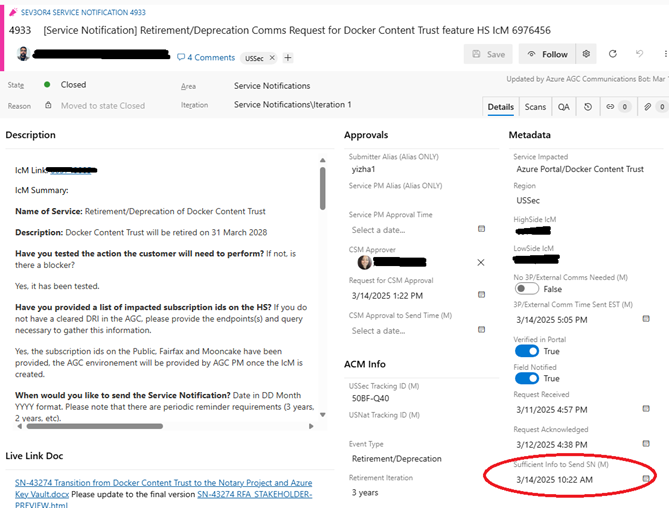
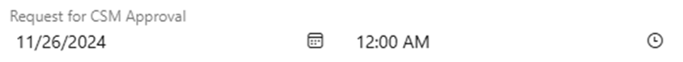
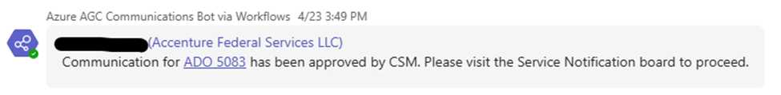

# Getting the SN Message Draft Approved

Last Modified: `@@LastModified`

---

## Service PMs Must Provide Approval Before Publication
 
When the operator is done working on the final draft of the customer message, they need to send it to both the 1) **Service PM** and then the 2) **CSM** for review and approval before publishing the communications. 

To get Service PM approval: 

1.	When the operator is ready to request approval, they should open the ADO card and enter the date in the **Sufficient Info to Send SN** field by clicking on the calendar icon and selecting today’s date (the time is automatically entered). 

<em>CAPTION: SN ADO card showing the Sufficient Info to Send SN field.</em>

2. Copy the SN customer message draft from the ADO card by selecting it and typing Ctrl+c. 

3. Paste the SN message into the LS IcM card 

To get CSM approval: 

1.	If the ADO Card is open, **change the Status of the card to “Active”** by selecting it from the dropdown menu on the left side of the card header. Click the “Save” button. 
    - Or, the operator can open the SN board by clicking on the Boards link in the left navigation (if you are not already viewing it) and update the status of the ADO card by clicking and dragging the card from the “In Progress” column to to the “**Pending Approval (Doing)**” column.

2.	Either method in Step 2 above will automatically update the Request for CSM Approval field with the date and time, a notification will be posted in the Teams channel, and the CSM will be notified that they have a new SN to review. 

<em>CAPTION: The Request for CSM Approval field in the ADO Card. </em>

3.	**Wait for the CSM to approve** the final draft of the customer message. 
    - If they have feedback, the operator should make any suggested changes/edits as soon as possible. The status of the ADO card will stay “Pending Approval (Doing)” as the final requested edits are made. 
    - When they do approve it, the CSM will move the ADO card from “Pending Approval (Doing)” to “Pending   Approval (Done)”. A notification will be posted in the Teams channel, and the operator should receive a notification. 
        -   They will also update the CSM Approval to Send Time field. 

<em>CAPTION: Teams notification showing the SN is approved by the CSM.</em>

