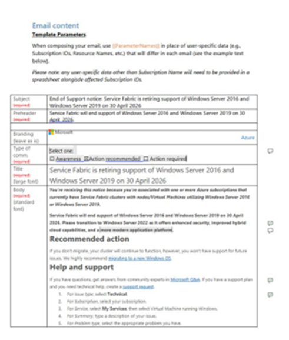
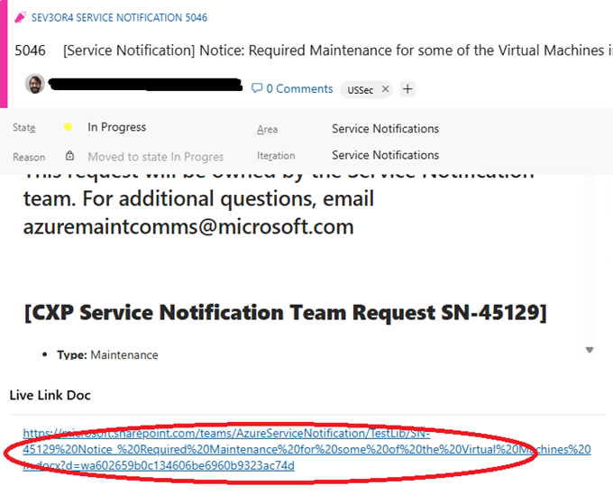

# The Customer Message 

Last Modified: `@@LastModified`

---

## Creating the SN Communication

After reviewing the SN request and receiving all of the needed information for the customer communications, the operator may need to revise the external customer message. When approved and published, this information will appear in the Service Health blade in the Azure Portal. 

First, the operator will need to move the proposed customer message from wherever it has been drafted by the engineering team to ADO to make edits to the final draft and get it reviewed and approved by the CSM. 

With SNs, the engineering team – usually the SN requester – creates the initial draft of the customer message. They start the customer message draft from a [template in SharePoint](https://microsoft.sharepoint.com/:w:/r/teams/AzureCXPAirGapJEDICXPTeam/_layouts/15/Doc.aspx?sourcedoc=%7B85C14275-C2F1-43B4-8270-173E9547E43A%7D&file=TemplateCustomerCommunications.docx&action=default&mobileredirect=true) that looks like this: 
 

<em>CAPTION: The SharePoint SN Template.</em>

However, they might share the customer message with the AGC AzComms team in several different ways, including: 

- In most cases, the customer message will be saved in a Live Link Doc (in SharePoint) which should be linked to the LS IcM ticket and copied to ADO. 
- It may be saved in the Authored Summary section of the IcM ticket.
- It may be sent to you separately by email.

Once the operator has located it, they will need to copy it into the Customer Message section of the ADO card.  

## Copying the Customer Message to ADO

To copy the customer message from the Live Link Doc to ADO, do the following: 

1.	In the ADO card, click on the link to the Live Link Doc.  

<em>CAPTION: Live Link Doc in the ADO Card.</em>

2.	In most cases, unless the ST made the Live Link document public, the operator will need to request access to it when they first try to open it. If needed, to get access: 

    a.	Click on the “Request Access” button on the page that appears.
    
    b.	Approval should be granted on the same business day. If it is not approved quickly, follow the steps on the “[Escalating Information Requests](..\Helpful%20Resources\escalating-information-requests.md)” page. 

3.	In the Live Link Doc (usually a SharePoint MS Word online document), select the entire SN message with your mouse (or type CTRL+a) and copy it by typing CTRL+c. 

4.	Go back to the ADO card, and paste the message into the Customer Message field by clicking in it and typing Ctrl+v.

## Editing the Text 

Once the operator has moved the initial draft of the Customer Message to the ADO card, the operator needs to work with the SN requester to create the final draft and get it approved by the CSM. And, depending on the type of SN, there may be additional approvals required. 

The operator will need to determine if the information that was pulled from the IcM Live Link Doc (or elsewhere) and copy pasted into the ADO card is a customer ready message that meets the standards and desired format. 

If the message is not customer-ready, the operator should make the necessary edits or revisions and work with the requester to finalize the content. Keep the following things in mind:  

1.	**Major headings**: The customer message usually includes these sections: 

    - **Title**: The title should be descriptive of the maintenance Stage, Service, Region, and expected customer impact. It should be saved in the ADO card “Title” field. Example: 
        
        _Important notice: Planned maintenance for Azure will impact virtual machines in West US 2 or Action required: Planned maintenance for Azure will impact virtual machines in East US 2 EUAP_

    - **Description**: The main body of the message, which is primarily written by the engineering team. Often includes information related to: 
        - Why are they receiving this message? 
        - Details of the upcoming planned change. 
        - Potential impacts of the change. 
        - Links to additional information or documentation. 

    - **Required action**: Not always a section within the customer message – depending on the type of SN. 

    - **Help and support**: Always try to provide the Support Area Path (SAP), so that questions are correctly routed within the ACE team.  

2.	**Formatting**: Text formatting should be used sparingly, except for: 

    - Make specific, urgent dates bold

3.	**Links**: Ensure that URLs for documents and websites provided to the customers in SNs are functional in the AGC:

    - Test them by using the CST Portal to copy and paste them into a browser on the HS (or just type them into a browser manually on the HS). 

    - Some URLs will need to be “converted” to work on the HS. See the “[Converting Low Side to High Side Links](https://eng.ms/docs/cloud-ai-platform/azure-edge-platform-aep/cai-silver/experience-silver-/silver-problem-management/azure-outage-communications/frontlinelivesite/sendingthefdp/converting-ls-hs-links)” TSG for more information. 

    - If they do not work on the HS, then broken links can be annotated by adding a “(commercial cloud link)” after the link in the text. Example: 
    
        _… you should transition to the Notary Project (commercial cloud link) ecosystem including their open-source supply chain tool …_
_
4. **Commercial Details**: If the planned event in the AGC environments is similar or related to work done on the commercial / public Cloud, the draft message shared with the AGC AzComms team may be based on the communications sent to commercial customers. Those commercial comms often include information that is not relevant or useful for AGC customers. Therefore, the operator needs to: 

    - Thoroughly review the draft message shared on the LS and verify the details are all relevant to AGC customers (do not just copy and paste it into the ADO field)

    - Remove anything that is not AGC-related before sending the draft customer message to the CSM for approval. 

    - Examples of information that is not relevant to AGC customers include: 
        - The commercial team’s date/time stamp on deployments 
        - Commercial cloud links should be reviewed for relevance to AGC customers 

### Example Customer Message

As an example, the following is the template the engineering team uses for a “Take Action/Action Required” SN customer message: 

>
>TITLE GOES HERE
>
>You’re receiving this notification because you're associated with one or more Azure subscriptions that use [SERVICE NAME]. 
>
>[Detailed description of notification]  
>
>**Required action**
>
>To avoid service disruptions and remain supported, please [REQUIRED ACTIONS]. 
>
>**Help and support** 
>
>If you have questions, get answers from community experts in [Microsoft Q&A](). If you have a support plan and you need technical help, create a support request.  
>
>OPTIONAL: Detailed steps for help with this product or service. Ask the requestor if any steps should be shared with customers. 
>
>1. Step 1
>
>2. Step 2
>
>3. Step 3
>
>Links provided herein may take you to a third-party website and are provided for convenience only. Third-party websites are subject to the third-party’s terms and privacy statements. 
>

Here is an example of an approved customer-ready SN based on the above template:

> Ubuntu 18.04 on Azure Kubernetes Service will be retired on 17 June 2025 in all regions of USSec. Replace with Ubuntu 22.04+. 
>
> You’re receiving this notification because you're associated with one or more Azure subscriptions that use Ubuntu 18.04 in an Azure Kubernetes Service cluster.  
>
> Ubuntu 18.04 on Azure Kubernetes Service will be retired on 17 June 2025. Please transition to a supported Ubuntu version by that date.
>
> Ubuntu 18.04 has been replaced by newer supported versions, including Ubuntu 22.04. We encourage you to transition to Ubuntu 22.04 before 17 June 2025 to experience the capabilities of Ubuntu 22.04 including kernel updates and security improvements.
>
> Starting on 17 June 2025, AKS will no longer create new node images for Ubuntu 18.04 or provide security updates. Existing node images will be deleted. Your node pools will be unsupported and you will no longer be able to scale.  
>
> **Required action**
>
> To avoid service disruptions and remain supported, please follow our instructions to upgrade your Kubernetes version to 1.25+ to migrate to a supported Ubuntu version by 17 June 2025. Migrate your nodepools to a supported Ubuntu version by 17 March 2028 to avoid breakage. For more information on this retirement, see AKS GitHub.  
>
> **Help and support**  
>
> If you have questions, get answers from community experts in Microsoft Q&A. If you have a support plan and you need technical help, create a support request.   
>
>1.	For Issue type, select “Technical”.    
>
> 2.	For Subscription, select your subscription.    
>
> 3.	Under Service, select “Kubernetes Service (AKS)”.
>
> 4.	Select, your Kubernetes resource then select, Problem type to be "Deprecation and Retirement".  
>
> 5.	Under Problem subtype select “Guidance on the Retirement of Linux or Windows Server”.  
>
> Links provided herein may take you to a third-party website and are provided for convenience only. Third-party websites are subject to the third-party’s terms and privacy statements. 

