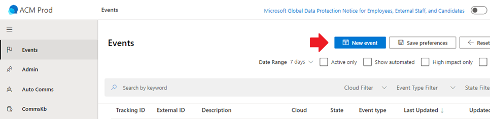
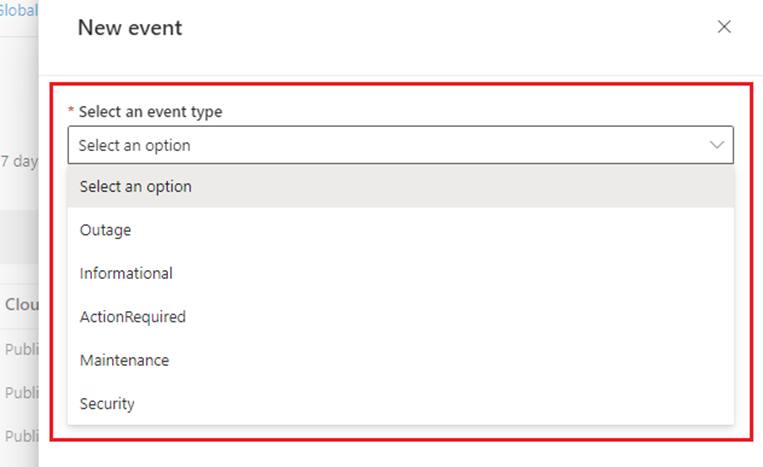
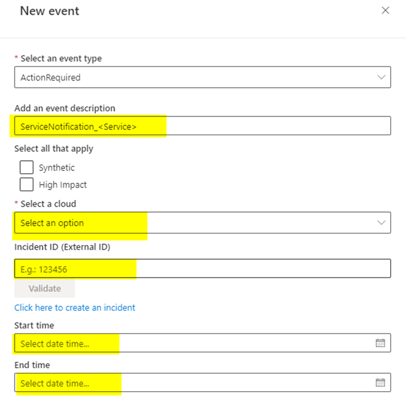
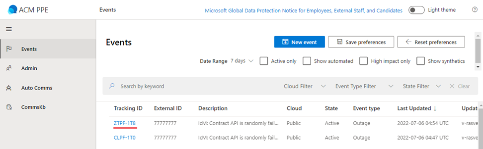

# Creating a New Event in ACM

Last Modified: `@@LastModified`

---

## SN Comms Are Connected to ACM Events

SN messages are connected to "**Events**" in ACM. For every new SN, the operator must create a new Event. 

To do that, once you have sent the customer message to the HS:

1. In the environment for which you will be sending the communications (USSec/USNat) open a new tab in the MS Edge web browser and navigate to the **Azure Communications Manager (ACM)** site: 

    | Environment | URL |
    | ----- | ---- |
    | USSec | https://communications.core.microsoft.scloud |
    | USNat | https://communications.core.eaglex.ic.gov |

2. Under the **Events** tab, select **New Event**.

<em>CAPTION: Creating a New Event in ACM.</em>

3. In the “**New Event**” panel that appears, on the Event Details tab, under “**Select an event type**”, choose the appropriate type. The options are: 
    - Informational
    - Action Required
    - Maintenance
    - Retirement
    - Outage
    - Security
    - Billing

<em>CAPTION: The Event Type Drop-Down Menu in ACM. </em>

>[!NOTE]
>Refer to the [Event Types](https://microsoft.sharepoint.com/:w:/r/teams/WAG/EngSys/Communications/Rapid_Recovery_Comms/Docs/service%20notification%20overview.docx?d=w30ceb3b8cd3d4dcaa23056442b942de9&csf=1&web=1&e=pPgHCY) documentation for more info. If the Event Type is not reasonably obvious, ask the CSM owner of the ADO card for guidance. 

4. Finish filling out the rest of the **New event** form:
    - **Event Description**: This is an internal field. 
        - Enter a descriptive name for the SN, based on the following format:   
            SN – [SERVICE] – [ADO ####] 
            Example:  
                SN - Virtual Machines - ADO 5040 
    - **Maintenance ID**: Enter the HS IcM number.
    - **Cloud**: Select the appropriate cloud (e.g. USSec, USNat).
    - **Planned start time**: Enter the time this Service change is scheduled to start.
    - **Planned end time**: Enter the time this Service change is scheduled to end. 
        - This window MUST be at least 2 hours from the start time. This gives the Service team time to recover if something goes wrong.
    - The remaining fields in the form are optional and can be left blank.

>[!NOTE]
>All times in ACM are saved in UTC format. But all times in ADO should be recorded in EST. The operator will have to do the conversion, but [M365 Copilot](https://m365.cloud.microsoft/chat/?auth=2&home=1&origindomain=microsoft365) can be used for this.
    

<em>CAPTION: The New Event Form fields in ACM.</em>

5. Select “Validate”

6. Select “Create Event”

7. The operator will be taken back to the main screen where they will see the full list of Events. 
 

<em>CAPTION: The Events list in ACM.</em>
