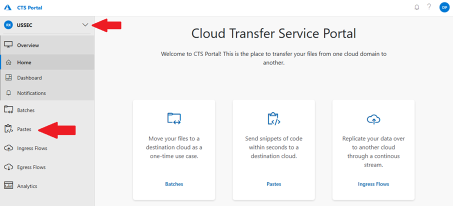

# Publishing the Service Notification

Last Modified: `@@LastModified`

---

## Once Approved, Send the Message to the HS 

Once the operator has all the required information, including the Subscription ID’s, and the customer message is approved, they can proceed to publish the SN in the HS ACM. 
Use the following steps to send the SN to customers. 

### Sending the SN from the LS to the HS

First, the operator must send the approved customer message from ADO on the LS to ACM on the HS. To do that: 

1.	Open the ADO card, select the approved customer message and copy it to the pasteboard by typing Ctrl+c. 

3.	Open the [CTS Portal](https://ctsportal.trafficmanager.net/) on the LS.

4.	Once there, select the Region to which you would like to send the text by clicking on the dropdown menu in the upper left of the page. The options are:
    - USSEC
    - USNAT

5.	Click on "**Pastes**" on the left side of the window.
 

<em>CAPTION: CTS Portal Home page showing the Cloud selection and left side navigation.</em>

5.	Click on the blue "**Create new paste**" button on the top right of the Pastes page.

6.	Enter a **Name** for the Paste. Only alphanumeric and hyphen characters are allowed (4-40 characters). It is suggested that operators use the following naming convention for their CTS Portal pastes: 

    **[ADO CARD NUMBER]000[SEQUENTIAL NUMBER OF PASTES FOR THE ADO CARD]**
    
    _For example, if “4555” is the ADO card the text is copied from, and “1” indicates this is the first paste sent for this SN:_ 

    _45550001_ 

7.	Select the **Language/Syntax Highlight**: Plain Text (default option)

8.	Paste the message that needs to be transferred to the HS by clicking inside the **Paste Content** field and typing Ctrl+v. 

>[!NOTE]
>Only plain text can be sent from the LS to the HS using the CTS Portal. This means that all formatting added in ADO – including Bolding, Italicization, embedded hyperlinks, and bulleted text – will be stripped out. The operator will have to reformat the message when the text is copied into the newly created event in ACM.  

9.	Click **“Create”**. 

7.	**Switch to the HS**, and open the CTS Portal for the Cloud that the Paste was sent to. 

8.	On the left side of the window, click on “**Pastes**”, and locate the Paste that was just sent in the list. Open the Paste by clicking on its title. 

9.	Select the SN text, copy it by typing Ctrl+c, and paste it into ACM in the Advisory / Portal Message field by typing Ctrl+v. (See "[Creating a New Targeted Communication in ACM]()" for more information.) 

    - Remember to fix the formatting of the message after pasting it into ACM (bold, italic, bulleted lists, and embedded hyperlinks). 

>[!NOTE]
>For more detailed information about using the CTS Portal, see the "[Using the Cloud Transfer Service Portal](https://eng.ms/docs/cloud-ai-platform/azure-edge-platform-aep/cai-silver/experience-silver-/silver-problem-management/azure-outage-communications/frontlinelivesite/sendingtheadvisory/usingthectsportal/using-cts-portal)" page on EngHub. 
