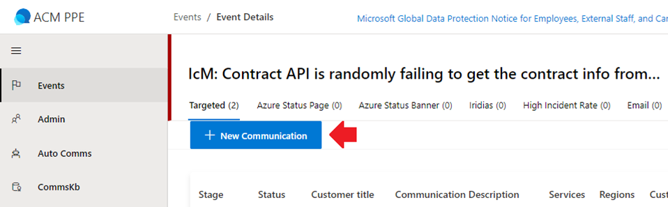
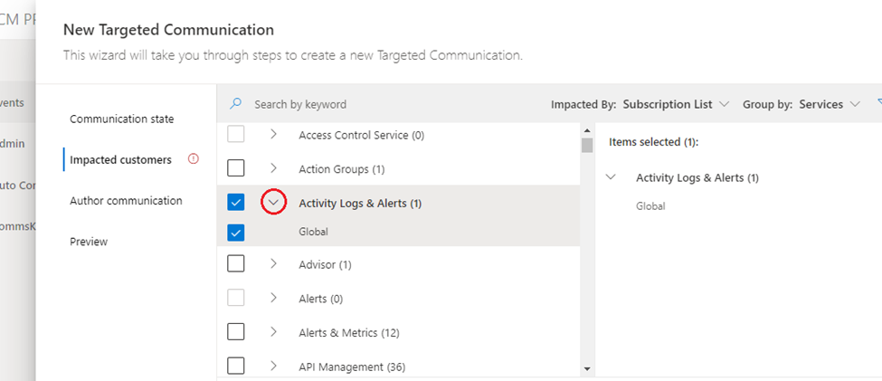

# Sending the SN in ACM 

Last Modified: `@@LastModified`

---

## Using the Event in ACM to Send the SN to Customers  

After creating the Event in ACM, the operator will create a New Communication in ACM related to the Event that was just created. To do this: 

1. In ACM on the HS, on the Events page, select the SN Event that was created previously by clicking on the Tracking ID Link. 

    a. Confirm that the correct Event has been opened before proceeding.

2. Select “**New Communication**”.
 

<em>CAPTION: The New Communication Button on the Targeted Tab of an Event in ACM. </em>

3.	Enter the following information in the form: 

    a. On the **"Communication State" tab** input the following:

    - **Description** - This is the internal description (will not be seen externally).  
        <em>Example:  
        ExpressRoute Site Maintenance in West Central US from 8/8 18:00UTC to 8/9 18:00UTC</em>

    - **Start time** - This is the time the change is scheduled to start.

    - **End time** - This is the time the change is scheduled to end.

    
    b. On the **"Impacted Customers" tab**, input the following:

    - Select **Services and Regions** (this is provided by the engineers on the bridge). 
    - Input **Subscriptions** (will not work without first entering Services and Regions):
        - Copy (Ctrl+c) and Paste (Ctrl+v) the provided SubID list from the HS IcM ticket
        - Select “Get Impact”
        - Ensure that the Subscription Count updates correctly
    - Select “Next”

    c. On the **“Author Communication” tab**, enter the Advisory message that was transferred to the HS using the CTS Portal. Ensure that all information is copied (Ctrl+c) and pasted (Ctrl+v) correctly:

    - **Select a template** - _Leave blank. This does not currently work in the AGC._ 
    - **Customer Title** - Copy (Ctrl+c) and paste (Ctrl+v) the Title here from the approved Customer Message sent over to the HS from the ADO card. 
    - **SMS Message**: Skip. This feature is not available in the AGC. 
    - **Portal Message**: After pasting the approved message in the field, be sure not to duplicate the Customer Title in the main body of the message. Then manually re-apply formatting, including: 
        - Hyperlinks - Verify that all hyperlinks work in the HS Cloud. 
            - If not, the hyperlink will either need to be converted to a working HS link, or be annotated as a “(commercial cloud link)”. See the “[Converting Low Side to High Side Links](https://eng.ms/docs/cloud-ai-platform/azure-edge-platform-aep/cai-silver/experience-silver-/silver-problem-management/azure-outage-communications/frontlinelivesite/sendingthefdp/converting-ls-hs-links)” page on the EngHub for more information.
        - Bold, italics and other text formatting
        - Bullets

<em>CAPTION: The Impacted Customers Section of the New Targeted Communications Forms.</em>

4.	When all required information has been inputted, select “Save and Publish.”
