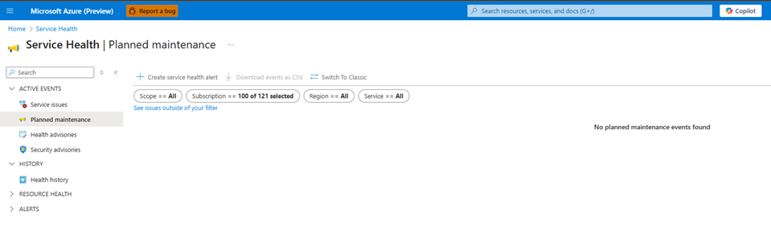
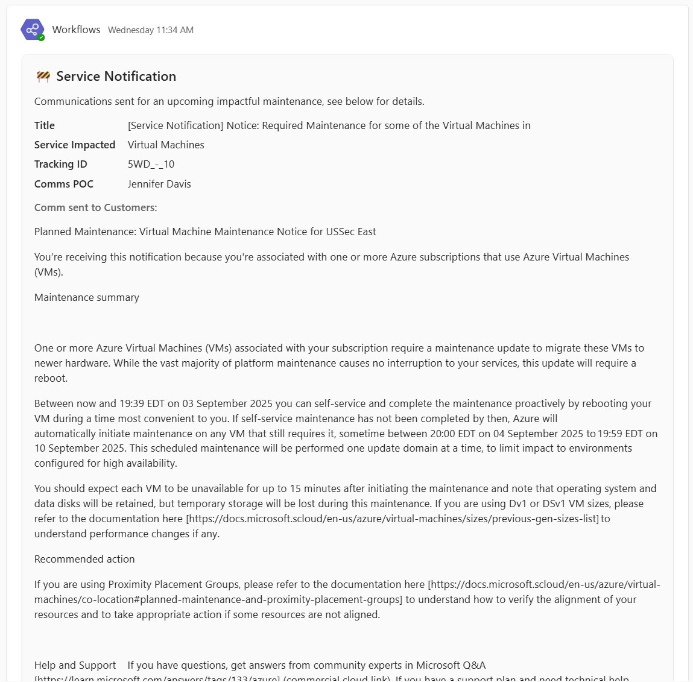

# After Communications Are Sent 

Last Modified: `@@LastModified`

---

## Verifying Delivery and Updating Tickets

After the SN has been sent, the operator will need to verify that the SN was successfully published. And, if so, they will need to update the LS IcM ticket and ADO card status. 

Verify the SN was published by doing the following: 

1. On the HS, open the AGC Azure Portal for the affected US government Cloud (USSec, or USNat). 

2. Navigate to “Service Health.”

3. Depending on the type of SN that was sent out, i.e. Emergency Maintenance, Planned Maintenance etc., the notification will populate in its respective section within the AGC Azure Portal. Look in the expected location for it. 
 

<em>CAPTION: Azure Service Health blade.</em>

**If the SN was successfully published**, do the following: 

1. Return to the LS environment.

2. Open the IcM ticket.
3. Paste the following message in the discussion (edit request/title) 

    a. Your request, [SN Request] [Title] has recently been transitioned to **Done** by our team. 

4. Mitigate / close the LS IcM ticket. 

>[!NOTE]
>Do ___NOT___ close the HS IcM ticket until after the event has passed. See below. 

4. Open the ADO card. 

5. Enter the Published Date noted from ACM into the "**3P/External Comm Time Sent EST (M)**" field in the ADO card.
 

<em>CAPTION: The Metadata Column in the ADO card showing the 3P/External Comm Time Sent Field. </em>

6. Click the "**Verified in Portal**" toggle (right below the "3P External Comm Time Sent" field) to "True".  

>>>[!NOTE]
>**IMPORTANT** Double check the formatting of the customer message before moving on to the next step!

7. Change the status of the ADO card by selecting “Closed” in the “State” dropdown menu on the left side of the card header. 

    a. Or, change the status by dragging and dropping the card on the ADO Board from the “Pending Approvals / Done” column to the "Closed" column.

<!--- 
8. Open the Teams channel for the appropriate Field team: 
    - [RX Field Service Notifications | AGC RX Field Outage Communications](https://teams.microsoft.com/l/channel/19%3A232c7e3ba7bb447d9c15acf31a1d7e6e%40thread.tacv2/RX%20Field%20Service%20Notifications?groupId=11e4a80f-ae72-4759-a1fb-1a6cc91cee52&tenantId=72f988bf-86f1-41af-91ab-2d7cd011db47)
    - [EX Field Service Notifications | AGC EX Field Outage Communications](https://teams.microsoft.com/l/channel/19%3A9751208a50cd444395d7169266c0e187%40thread.tacv2/EX%20Field%20Service%20Notifications?groupId=0c9df78d-d91e-4ae8-8e3f-e9071edff525&tenantId=72f988bf-86f1-41af-91ab-2d7cd011db47)

9. Confirm that a notification was successfully posted in the Teams chat alerting the Field teams that the SN was published in ACM. It will look like this: 

<em>CAPTION: Notification in Teams chat alerting the Field teams about a published SN.</em>

10. If the notification does NOT appear in the Teams chat for the Field teams, the operator should alert the CSM in Teams. 

>[!NOTE]
>When the operator closes the SN ADO card, an automation sends the notification to the Teams chat. It also automatically toggles the "**Field Notified**" field to "True". The operator should not touch that field. 

-->

## After the SN Event Occurs

After the planned event has passed, the operator will need to the final HS IcM clean up tasks: 

1. Return to the HS and open the HS IcM SN ticket. 

2. Click **“Resolve”** to close the HS IcM ticket. 
